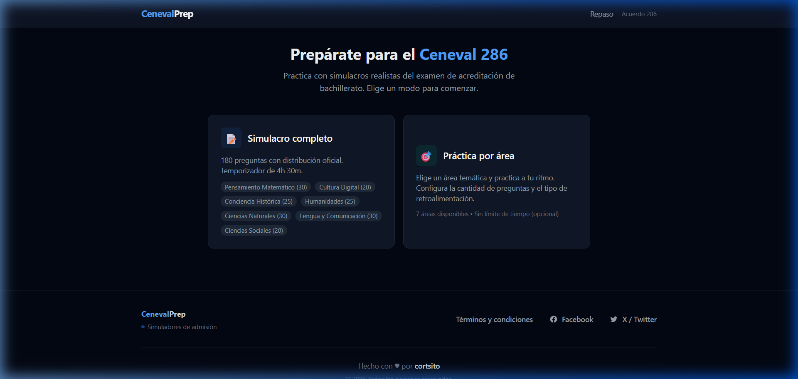

# CenevalPrep

<div align="center">

**Simulador de exámenes para el Ceneval Acuerdo 286**

Prepárate para el examen de acreditación de bachillerato con simulacros realistas, retroalimentación detallada y exportación a Anki.



[](https://react.dev/)
[](https://vite.dev/)
[](https://tailwindcss.com/)
[](#licencia)

</div>

---

## Qué es esto

CenevalPrep es una plataforma web gratuita que simula el examen **Ceneval Acuerdo 286** (acreditación de bachillerato en México). Funciona 100% en el navegador — sin backend, sin login, sin datos personales.

## Características

| Función | Descripción |
|---------|-------------|
| **Simulacro completo** | 180 preguntas con distribución oficial y temporizador de 4h 30min |
| **Práctica por área** | Elige entre 7 áreas temáticas, configura cantidad y retroalimentación |
| **Revisión de resultados** | Desglose por área con porcentajes, explicaciones pregunta por pregunta |
| **Exportación a Anki** | Guarda preguntas como flashcards y descarga un archivo `.txt` importable en Anki |

### Áreas temáticas

- Pensamiento Matemático (30 preguntas)
- Cultura Digital (20)
- Conciencia Histórica (25)
- Humanidades (25)
- Ciencias Naturales (30)
- Lengua y Comunicación (30)
- Ciencias Sociales (20)

## Cómo funciona

```
Inicio → Elige modo → Responde preguntas → Ve resultados → Guarda para Anki → Descarga
```

1. **Elige un modo**: simulacro completo o práctica por área
2. **Responde las preguntas**: navega libremente, marca preguntas para revisión
3. **Revisa tus resultados**: ve tu porcentaje global, por área, y la explicación de cada pregunta
4. **Guarda para Anki** *(opcional)*: marca las preguntas que quieras repasar
5. **Descarga tu mazo**: ve a la sección "Repaso" y descarga el archivo `.txt`
6. **Importa en Anki**: abre Anki → Archivo → Importar → selecciona el archivo

## Instalación local

### Requisitos

- [Node.js](https://nodejs.org/) v18 o superior
- npm (incluido con Node.js)

### Pasos

```bash
# 1. Clona el repositorio
git clone https://github.com/cortsito/simulador.git
cd simulador

# 2. Instala las dependencias
npm install

# 3. Inicia el servidor de desarrollo
npm run dev
```

Abre tu navegador en la URL que aparezca (normalmente `http://localhost:5173/simulador/`).

### Otros comandos

```bash
npm run build    # genera el build de producción en /dist
npm run preview  # preview del build de producción
npm run deploy   # deploy a GitHub Pages
```

## Stack técnico

| Tecnología | Uso |
|-----------|-----|
| **React 19** | UI y componentes |
| **Vite 7** | Bundler y dev server |
| **Tailwind CSS 4** | Estilos |
| **JSON estático** | Banco de preguntas (sin API) |
| **localStorage** | Persistencia del mazo de Anki |
| **GitHub Pages** | Hosting |

## Estructura del proyecto

```
src/
├── components/       # Componentes de UI
│   ├── Home.jsx          # Pantalla de inicio
│   ├── ExamConfig.jsx    # Configuración de práctica
│   ├── ExamRunner.jsx    # Motor del examen
│   ├── Results.jsx       # Pantalla de resultados
│   ├── QuestionReview.jsx # Revisión individual de preguntas
│   ├── AnkiDeck.jsx      # Gestión del mazo de Anki
│   ├── Layout.jsx        # Layout global con navegación
│   └── Terms.jsx         # Términos y condiciones
├── hooks/            # Lógica de negocio
│   ├── useExam.js        # Estado del examen activo
│   ├── useQuestionBank.js # Acceso al banco de preguntas
│   └── useAnkiDeck.js    # Persistencia del mazo de Anki
├── utils/            # Funciones puras
│   ├── shuffle.js        # Fisher-Yates shuffle
│   ├── scoring.js        # Cálculo de puntuación
│   ├── formatTime.js     # Formato de tiempo
│   └── ankiExport.js     # Exportación TSV para Anki
├── data/             # Datos estáticos
│   ├── questions.json    # Banco de preguntas
│   └── exam-config.js   # Configuración del examen
├── App.jsx           # Router principal
├── main.jsx          # Entry point
└── index.css         # Estilos globales
```

## Licencia

MIT — usa, modifica y comparte libremente.

---

<div align="center">

Hecho con ♥ por [cortsito](https://github.com/cortsito)

</div>
